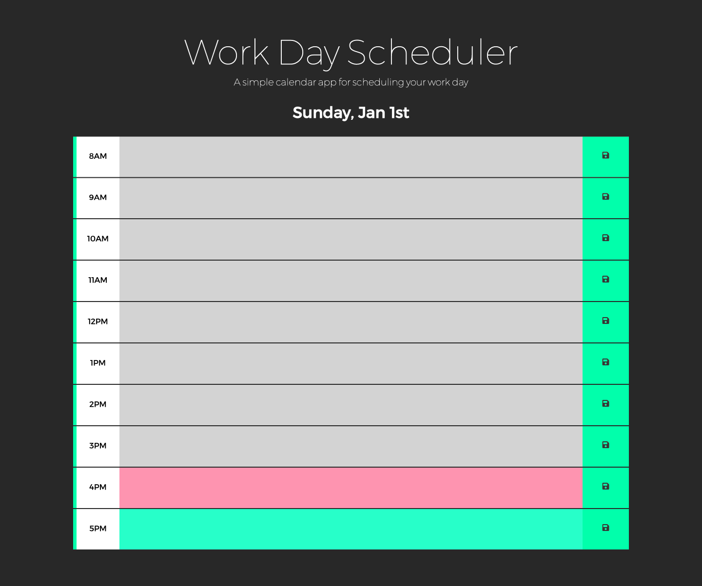

# Work_Day_Scheduler

## Description
The aim of this project was to build an application that stores daily events in a planner.

The application needs to...
Display the current day at the top of the calendar when the user opens the planner.
Present timeblocks for standard business hours when the user scrolls down.
Colour-code each timeblock based on past, present and future when the timeblock is viewed.
Allow a user to enter an event when they click a timeblock.
Save the event in local storage when the save button is clicked in that timeblock.
Persist events between refreshes of a page.

## Installation

N/A

## Usage

The application can be accessed via an internet browser and the results can be seen in the console.

Link: https://drrobertson9673.github.io/Work_Day_Scheduler/

## Credits

N/A

## License

MIT licence